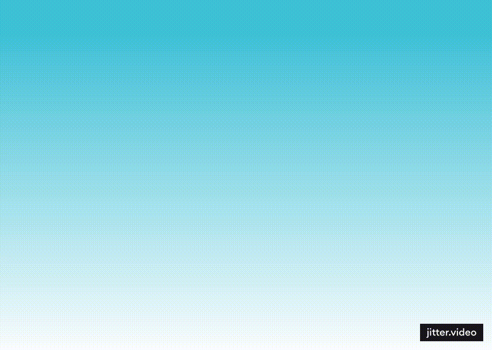
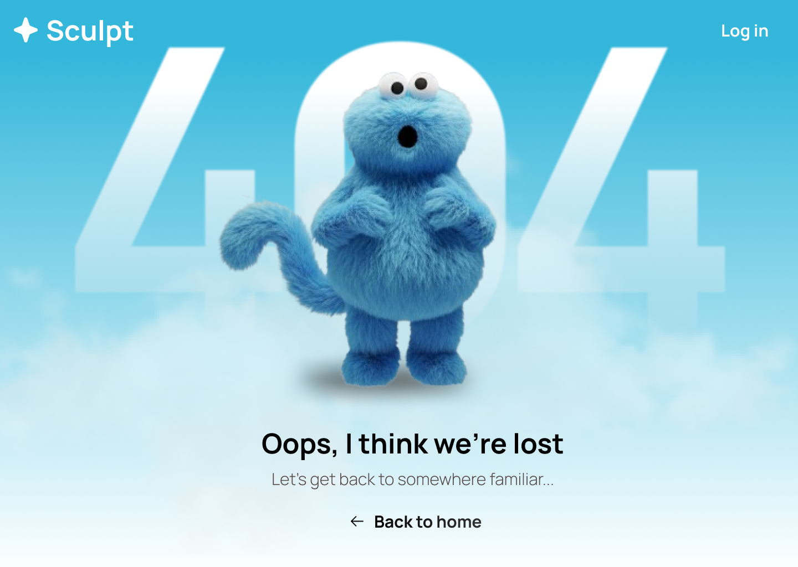

# 404 Error Page – UI & Motion Design

This project showcases a creative 404 error page designed as part of my learning in UI design, motion design, and creative web experiences.

The focus of this project is on visual storytelling, layout design, and animation rather than code implementation.

---

## 🎨 Tools Used
- Figma – UI and layout design
- Gemini – AI-generated visual assets
- Jitter – Character animation (free version, watermark included)

---

## 🎥 Full Preview

---

## 🖌 UI Design (Figma)

---

## 🕺 Character Animation

---

## 🧠 Learning Outcomes
- UI layout and visual hierarchy
- Using AI tools for creative asset generation
- Basic motion design and animation flow
- Designing engaging error pages for web experiences

---

## 📌 Note
This is a design-focused project and does not include frontend code.  
The design may be converted into a functional 404 page using HTML, CSS, and JavaScript in the future.
